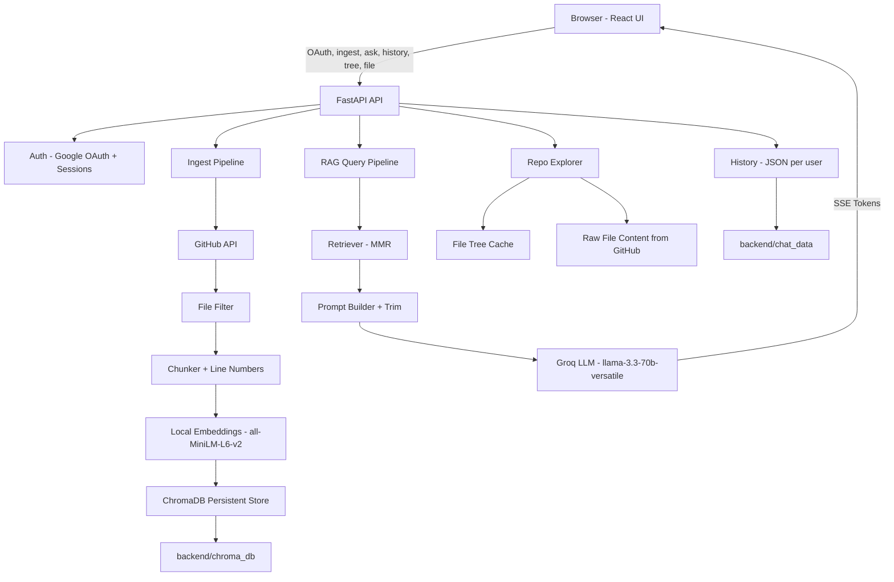

# RepoRAG - GitHub Repository RAG Assistant

Ask questions about any GitHub codebase. The app ingests a repo, builds a local vector index, and answers questions with retrieval-augmented generation (RAG). It also shows a file tree and lets you open raw file content from GitHub.

## What This Project Includes

- FastAPI backend with Google OAuth, ingestion, RAG, and streaming answers (SSE)
- React frontend (Vite) with repo ingest, file tree, chat history, and code viewer
- Local embeddings with `sentence-transformers` and persistent ChromaDB storage
- Groq LLM for answer generation

## System Architecture

```
Browser (React)
  |  (OAuth, ingest, ask, history, tree, file)
  v
FastAPI API (backend/api/main.py)
  |-- Auth: Google OAuth + session cookies
  |-- History: JSON files per user (backend/chat_data)
  |-- Repo ingest pipeline:
  |     GitHub API -> file filter -> chunker -> embeddings -> ChromaDB
  |-- RAG query pipeline:
  |     Retriever -> prompt -> Groq LLM -> SSE stream
  |-- File explorer:
  |     Cached file tree + raw file content from GitHub
  v
Storage
  |-- ChromaDB persistent store (backend/chroma_db)
  |-- User chat history (backend/chat_data)
```



### Ingestion Flow

1. Frontend calls `POST /ingest` with a GitHub repo URL.
2. Backend uses GitHub API to fetch files and filter by allowed extensions.
3. Files are chunked with language-aware separators and line numbers.
4. Chunks are embedded locally with `all-MiniLM-L6-v2`.
5. Embeddings are stored in ChromaDB (persistent). A file tree is built and cached.

### Query Flow

1. Frontend calls `POST /ask/stream` with repo name and question.
2. Backend loads the repo vector store and retrieves relevant chunks.
3. Context is trimmed and sent to Groq LLM (`llama-3.3-70b-versatile`).
4. Tokens are streamed to the client over SSE.

## Key Components

Backend
- `backend/api/main.py` FastAPI app, auth, history, repo endpoints, RAG endpoints
- `backend/ingestion/github_loader.py` GitHub fetcher, filters, file tree builder
- `backend/ingestion/chunker.py` chunking with line ranges and dedup
- `backend/rag/vector_store.py` ChromaDB persistence + local embeddings
- `backend/rag/query_engine.py` retrieval, prompt, caching, Groq LLM

Frontend
- `frontend/src/App.jsx` main layout, auth gate, panels, code viewer
- `frontend/src/components/ChatPanel.jsx` chat UI and streaming answers
- `frontend/src/components/IngestPanel.jsx` repo ingestion UI
- `frontend/src/components/FileTree.jsx` repo tree browser
- `frontend/src/components/CodeViewer.jsx` raw file viewer
- `frontend/src/hooks/useChat.js` chat state, history persistence, SSE handling

## API Endpoints

Auth
- `GET /auth/login`
- `GET /auth/callback`
- `GET /auth/user`
- `GET /auth/logout`

Core
- `GET /health`
- `GET /repos`
- `POST /ingest`
- `POST /ask`
- `POST /ask/stream`

History
- `GET /history`
- `POST /history`
- `DELETE /history`
- `DELETE /history/{session_id}`

Repo Explorer
- `GET /repo/{repo_name}/tree`
- `GET /repo/{repo_name}/file?path=...`

## Environment Variables

Backend (backend/.env)
- `GITHUB_TOKEN` GitHub API token (required for private repos)
- `GROQ_API_KEY` Groq API key for LLM
- `SECRET_KEY` session secret for cookies
- `GOOGLE_CLIENT_ID` Google OAuth client ID
- `GOOGLE_CLIENT_SECRET` Google OAuth client secret
- `OAUTH_REDIRECT_URI` OAuth callback URL
- `FRONTEND_URL` URL to redirect after login/logout
- `CHROMA_PERSIST_DIR` optional path for ChromaDB (default `./chroma_db`)

Frontend (frontend/.env)
- `VITE_API_URL` backend base URL used in `App.jsx` (auth)
- `VITE_API_BASE_URL` backend base URL used in `useChat.js` (API calls)

## Local Setup

Backend
```bash
cd backend
python -m venv .venv
.\.venv\Scripts\activate
pip install -r requirements.txt
uvicorn api.main:app --reload --port 8000
```

Frontend
```bash
cd frontend
npm install
npm run dev
```

## Project Structure

```
github-assistant/
  backend/
    api/
    ingestion/
    rag/
    chroma_db/
    chat_data/
    requirements.txt
  frontend/
    src/
      components/
      hooks/
    package.json
```

## Notes

- The repo tree is cached in memory and rebuilt on demand after server restart.
- Query results are cached for 1 hour to reduce repeated LLM calls.
- File content is fetched live from GitHub for the code viewer.
